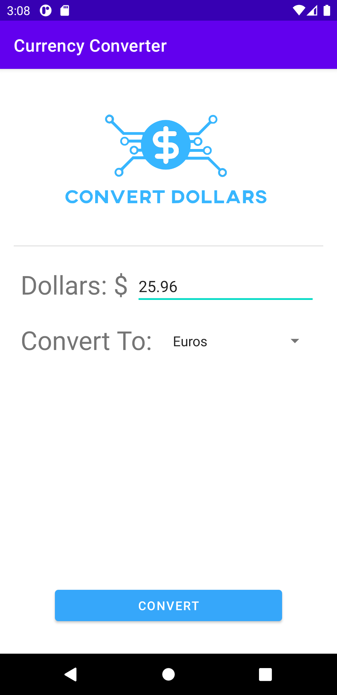
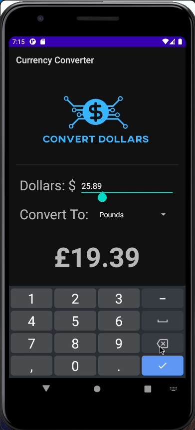

# Currency Conversion App
## Description
Have you ever been to a foreign country? If so, you'd know it's hard to remember how to convert your American dollars to other Contry's currency. This was a problem for me when I lived in a different country for a few years. This applicaton is the solution. Avaliable for your android devices, this app takes away all of the stress of trying to remember the conversion rate. It takes in your input and coverts the dollars you put in into what ever currency is avaliable. 

## Development Environment
To set up this development environment, you must first download Android studio [here.](https://developer.android.com/studio) Androi studio should automatically install itself onto your computer. It should also donload an install an android emulator. This will help you to build, test and deploy your android apps. After that, all the heavy lifting is done through android studio. 

## Building/Running this app
### On an android device: 
Download the contents of the folder ["API"](./API) found in this repository. Download the file onto your android device. After downloading it to your android device, run the .apk file. This file should automatically install the application onto your device. If you are having issues installing the app, look at your privacy settings. Remember to allow third party application instalations on your device.

### On a computer:
Downlad the entire contents of this repository. After that, open the folder containing these files in Android Studio. Wait until Android Studio is finished setting things up, then press the green play button at the top of your screen. This will automatically open up a emulation of an android phone for you to test the app on.

## ScreenShots

## Useful Websites
* [Implementation of Spinners Video](https://www.youtube.com/watch?v=N4PuIa1P0PM)
* [Text View Documentation](http://tutorials.jenkov.com/android/textview.html#:~:text=You%20can%20set%20the%20text,using%20its%20setText()%20method.&text=The%20text%20is%20set%20via,text%20defined%20in%20the%20strings.)
* [Android Studio Tutorial](https://www.youtube.com/watch?v=Ob4vSoWud9k)
* [Android Studio/Google Codelabs](https://codelabs.developers.google.com/?cat=android)